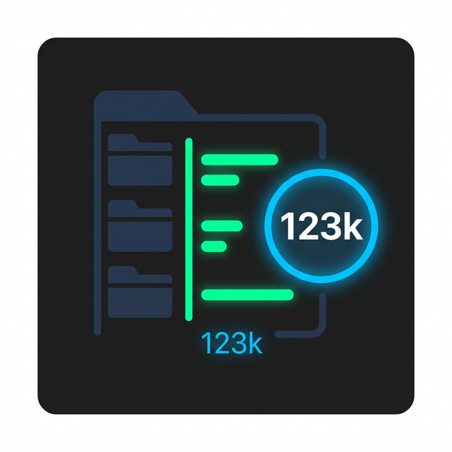
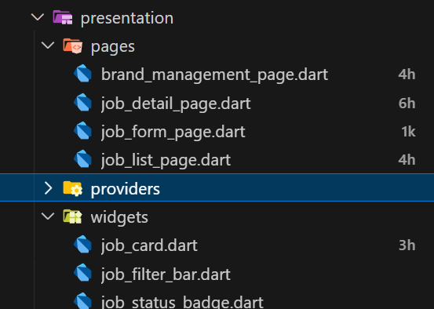

  
  <h1>Explorer Line Count</h1>
  
<em>Display line count for files directly in the VS Code Explorer view.</em>

---

## 🚀 Features

Get a quick overview of your codebase size without opening files! **Explorer Line Count** adds elegant, unobtrusive badges to files in your VS Code Explorer pane showing their exact line count.

- **Instant Visibility:** See file sizes at a glance.
- **Smart Formatting:** Large files use compact formats like `1h` (100+), `2k` (2000+), `9k` (9000+) to keep the UI clean.
- **Highly Configurable:** Control exactly which files show counts based on extension or file size.
- **Performance Optimized:** Uses caching, debouncing, and batch invalidation to ensure your editor remains lightning fast.
- **Clean Tooltips:** Hover over a badge to see the exact line count.

  <!-- TODO: Replace with actual screenshot or GIF -->
  

## ⚙️ Configuration

Tweak the extension to your exact needs in VS Code Settings (`Ctrl+,` or `Cmd+,`):

| Setting | Type | Default | Description |
|---------|------|---------|-------------|
| `explorerLineCount.allowedExtensions` | `array` | `[".ts", ".js", ...]` | List of file extensions to process. Include the dot (e.g. `.ts`). |
| `explorerLineCount.ignoredFolders` | `array` | `["node_modules", ".git", ...]` | Folder names to ignore when counting lines. |
| `explorerLineCount.maxFileSize` | `number` | `2` | Maximum file size in MB. Files larger than this are skipped for performance. |
| `explorerLineCount.minLineDisplay` | `number` | `0` | Only show the badge for files with at least this many lines (tooltip still shows for all). |

*Tip: Search for `Explorer Line Count` in your settings to quickly find these options.*

## ⚡ Performance

This extension is built with performance in mind:
1. **Asynchronous Reading:** File reading is non-blocking.
2. **Result Caching:** Line counts are saved in memory and only updated on save/rename/delete.
3. **Smart Skip:** It ignores `.git`, `node_modules`, and large binaries by default.

## 🐛 Issues & Feedback

If you encounter any bugs or have feature requests, please open an issue on the [GitHub Repository](https://github.com/philau2512/explorer-line-count/issues).

---
**Enjoying Explorer Line Count?** Leave a review on the [Open VSX Registry](https://open-vsx.org/extension/philau2512/explorer-line-count) ⭐⭐⭐⭐⭐
